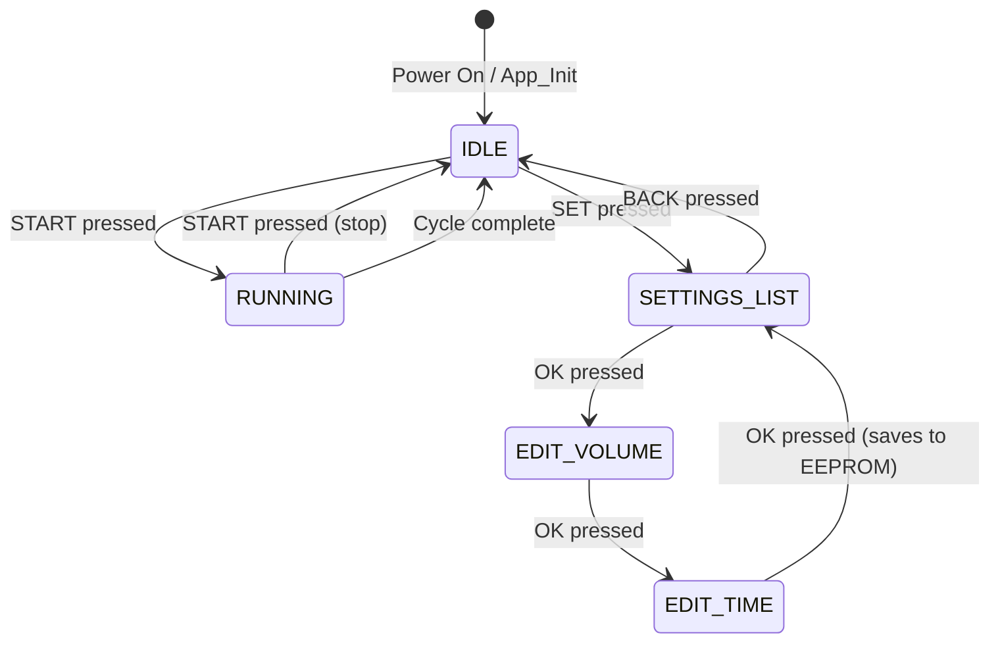

# Oil Machine – STM32F103 Firmware Walkthrough

## Files Created

| File | Description |
|------|-------------|
| `Core/Inc/lcd.h` | LCD 16×2 4-bit driver header |
| `Core/Src/lcd.c` | LCD driver implementation |
| `Core/Inc/eeprom.h` | CAT25320 SPI EEPROM driver header |
| `Core/Src/eeprom.c` | EEPROM driver (page-aware write, WIP poll) |
| `Core/Inc/app.h` | Application types, states, program struct |
| `Core/Src/app.c` | Full state machine application logic |
| `Core/Src/main.c` | Updated – calls `App_Init()` + `App_Run()` |

---

## Hardware Pin Map (from CubeMX / main.h)

### Inputs – All Active-LOW

| Signal | Pin | Port |
|--------|-----|------|
| Proximity (Metal Sensor) | PA0 | GPIOA |
| Start/Stop button | PA1 | GPIOA |
| Manual Pump button | PA2 | GPIOA |
| SET (Settings) button | PA3 | GPIOA |
| BACK button | PA4 | GPIOA |
| OK button | PB1 | GPIOB |
| DOWN button | PB10 | GPIOB |
| UP button | PB11 | GPIOB |

### Outputs

| Signal | Pin | Port |
|--------|-----|------|
| LCD EN | PA8 | GPIOA |
| LCD RS | PA9 | GPIOA |
| Buzzer | PA10 | GPIOA |
| Valve (relay) | PA11 | GPIOA |
| Motor (relay) | PA12 | GPIOA |
| LCD D4 (LD4) | PB15 | GPIOB |
| LCD D5 (LD5) | PB14 | GPIOB |
| LCD D6 (LD6) | PB13 | GPIOB |
| LCD D7 (LD7) | PB12 | GPIOB |
| EEPROM CS | PB0 | GPIOB |

> [!IMPORTANT]
> **LCD wiring assumption**: LD4=PB15→D4, LD5=PB14→D5, LD6=PB13→D6, LD7=PB12→D7.
> Verify this matches your physical wiring. If pins are reversed, edit `LCD_SetDataPins()` in `lcd.c`.

---

## State Machine



### IDLE State
- **Manual Pump held** → Motor ON (released → Motor OFF). Only works when idle.
- **UP/DOWN** → scroll selected program (1–10) on LCD row 0
- **SET** → enter Settings
- **START** → begin auto cycle (Valve ON first)

### RUNNING State (Auto Cycle)
```
VALVE_ON → wait Proximity LOW
    ↓ detected
MOTOR_ON → run for program time_ms
    ↓ time elapsed
MOTOR_OFF → wait 1000 ms
    ↓
VALVE_OFF → cycle done → back to IDLE
```
- **START** at any sub-state → immediate stop (Motor OFF + Valve OFF → IDLE)

### SETTINGS_LIST State
- **UP/DOWN** → choose program to edit (1–10)
- **OK** → enter Edit Volume
- **BACK** → return to IDLE (no changes)

### EDIT_VOLUME State
- **UP** → volume += 100 mL (wraps at 9900)
- **DOWN** → volume -= 100 mL (wraps at 100)
- **OK** → save value to RAM, move to Edit Time

### EDIT_TIME State
- **UP** → time += 100 ms (wraps at 99900)
- **DOWN** → time -= 100 ms (wraps at 100)
- **OK** → saves **both** volume & time to EEPROM → shows "Saved Prog X Successfully!" → back to Settings List

---

## EEPROM Layout (CAT25320 – 4096 bytes)

Each program = 8 bytes (4 bytes volume + 4 bytes time, little-endian):

| Address | Content |
|---------|---------|
| 0x0000–0x0007 | Program 1 (vol[4] + time[4]) |
| 0x0008–0x000F | Program 2 |
| … | … |
| 0x0048–0x004F | Program 10 |

> [!NOTE]
> If EEPROM is blank (0xFFFFFFFF), programs default to 100 mL / 100 ms.

---

## Programs Data Structure

```c
typedef struct {
    uint32_t volume_ml;  // 100 to 9900, step 100
    uint32_t time_ms;    // 100 to 99900, step 100
} Program_t;
```

10 programs stored in `g_programs[10]`.

---

## LCD Screens

### IDLE
```
Prog: 1         
 100mL   100ms  
```

### RUNNING
```
** RUNNING **   
Prog: 1         
```

### SETTINGS_LIST
```
>Prog 3 Settings
 500mL  2000ms  
```

### EDIT_VOLUME
```
Edit P3 Volume: 
   500 mL       
```

### EDIT_TIME
```
Edit P3 Time:   
  2000 ms       
```

### After Save
```
 Saved Prog 3   
  Successfully! 
```

---

> [!TIP]
> **Button debounce** is 30 ms, implemented per-button using `HAL_GetTick()` edge detection.
> No interrupts needed – everything is polled in `App_Run()`.
